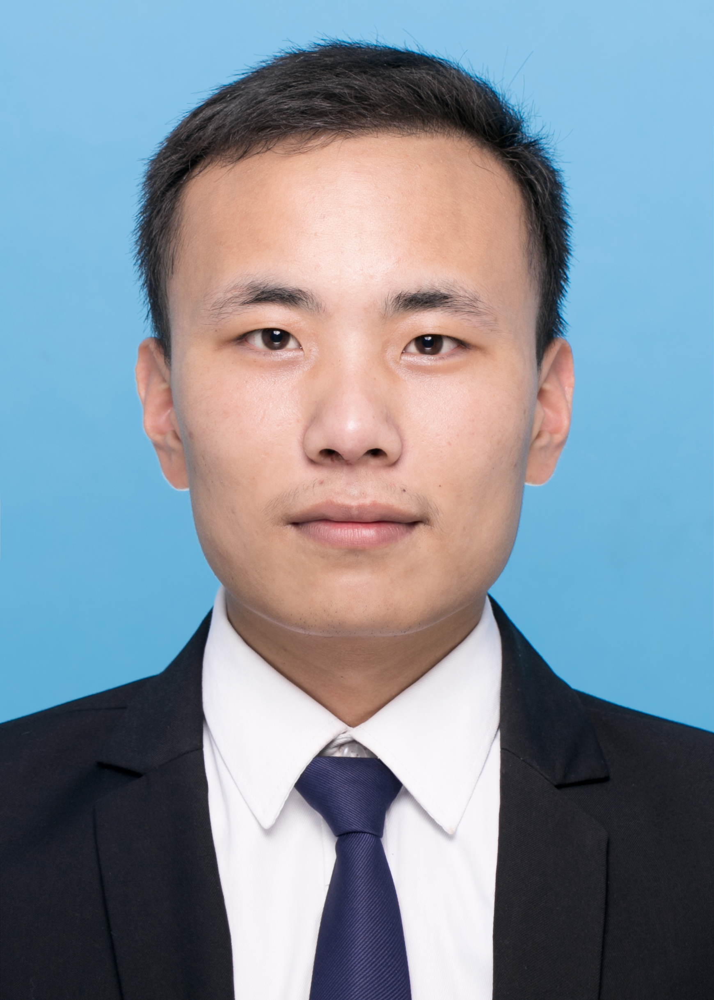

# About Me

Hi! Here is **Chunjiang Wang (Ethan, 王春江)**. 

I am currently a third-year Ph.D. student in the [MIRACLE Lab](https://miracle.ustc.edu.cn/main.htm) at the School of Biomedical Engineering, University of Science and Technology of China (USTC), advised by [Prof. S. Kevin Zhou](https://scholar.google.com/citations?user=8eNm2GMAAAAJ&hl=en). I received my M.S. degree from the College of Intelligence and Computing, Tianjin University in 2022, where I was advised by [Prof. Shanjiang Tang](https://scholar.google.com.sg/citations?user=B3-5FJUAAAAJ&hl=en). Prior to that, I earned my B.E. degree from the School of Computer Science and Technology, Tiangong University in 2019.

My research interests center around **trustworthy medical image analysis, vision-language alignment, and multi-modal fusion**. My work aims to develop reliable and robust medical AI systems by bridging the gap between visual and linguistic modalities, enhancing interpretability, and ensuring trustworthy decision-making in clinical scenarios.

I am always open to discussions and collaborations. Feel free to reach out to me at: chunjiang_wang [at] mail.ustc.edu.cn

---

## News and Updates

- **08/2025**：One paper is accepted by **IJCAI 2025**. Thanks to all collaborators! See you in Canada or Guangzhou!
- **08/2024**：One paper is accepted by **ISBI 2024**. Thanks to all collaborators!!

<!-- <blockquote class="twitter-tweet">
Thrilled to be an AAAI-UC Scholar at <a href="https://twitter.com/hashtag/AAAI24?src=hash&amp;ref_src=twsrc%5Etfw">#AAAI24</a>, thanks to <a href="https://twitter.com/hashtag/AAAI?src=hash&amp;ref_src=twsrc%5Etfw">#AAAI</a> &amp; <a href="https://twitter.com/hashtag/GoogleExploreCSR?src=hash&amp;ref_src=twsrc%5Etfw">#GoogleExploreCSR</a> for the sponsorship. Grateful for the knowledge gained and new friendships formed.  Wonderful trip in Vancouver. Looking forward to staying connected with all.<a href="https://twitter.com/hashtag/AAAI24?src=hash&amp;ref_src=twsrc%5Etfw">#AAAI24</a> <a href="https://twitter.com/hashtag/Vancouver?src=hash&amp;ref_src=twsrc%5Etfw">#Vancouver</a> <a href="https://twitter.com/hashtag/GoogleExploreCSR?src=hash&amp;ref_src=twsrc%5Etfw">#GoogleExploreCSR</a> <a href="https://t.co/wUQUp8XlSM">pic.twitter.com/wUQUp8XlSM</a>
&mdash; Hanlin CAI (seeking a PhD position 2025) (@lancecai2002) <a href="https://twitter.com/lancecai2002/status/1762210025173344260?ref_src=twsrc%5Etfw">February 26, 2024</a></blockquote>  -->

